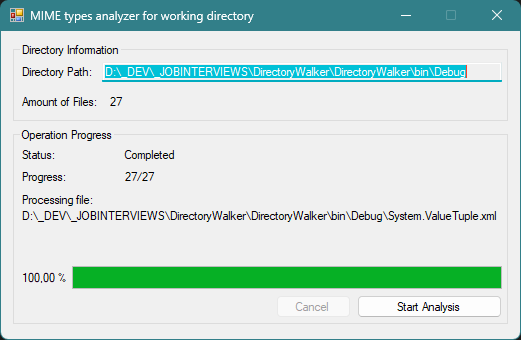

# DirectoryWalker
Directory walker that builds html report of MIME types in application working directory

This application were written for my job interview that performs search in application working directory and builds
directory tree of directories and files in subdirectories with their MIME types and filesizes.

Feel free to fork, use or fix things in this app.

Here is an example report screenshot: [here](RepoAssets/ReportExample.png)

Application screenshot:

